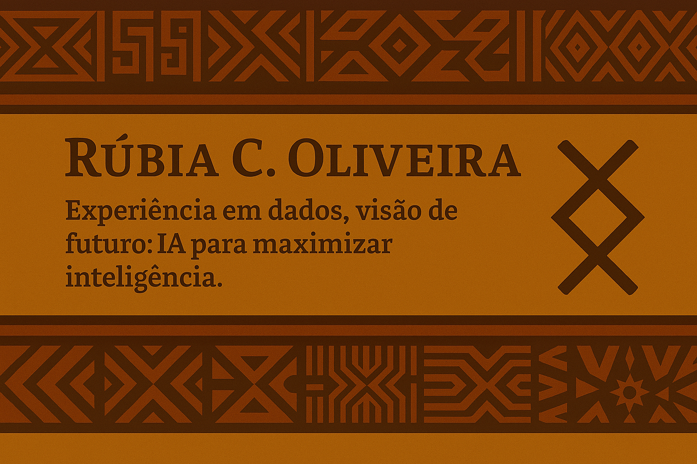

<!-- ============================================================ -->
<!-- README PERSONALIZADO — RÚBIA C. OLIVEIRA                     -->
<!-- ============================================================ -->

  

<h1 align="center">🌿 Rúbia C. Oliveira</h1>

  <em>Transformando dados em inteligência desde a adolescência. Agora, usando a IA nessa missão.</em>

  
  

---

## 🎧 Projeto: Podcast Gerado por I.A.s

> Projeto com o objetivo de gerar um **podcast automatizado com ferramentas de IA**, explorando processos criativos, prompts otimizados e automações integradas.

---

### 💡 Tecnologias utilizadas

- 🤖 [ChatGPT](https://chat.openai.com/)
- 🎨 [MidJourney](https://www.midjourney.com/app/)
- 🗣️ [ElevenLabs](https://beta.elevenlabs.io/)

---

### ✨ Como foi feito

- Roteiro criado via ChatGPT  
- Voz sintetizada pela ElevenLabs  
- Capas geradas no MidJourney  

---

### 🛠️ Instruções de uso

1. Gerar o roteiro base com ChatGPT usando os prompts.
2. Usar o texto gerado para criar a voz no ElevenLabs.  
3. Gerar a arte de capa com MidJourney.  
4. Unir tudo no CapCut e finalizar seu podcast.  

---

## 👩‍💻 Sobre mim

"Teimosa que só ela" diz Dona Realina desde o meu nascimento. Hoje, acho que é a minha maior qualidade (e ela também). 
Nessa etapa da jornarda, em constante teimosia com o estudo de dados voltados para Machine Learning e IA Generativa.

 

---

  <em>⌨️ projeto idealizado por <a href="https://github.com/olivru">Rúbia C. Oliveira</a></em>

